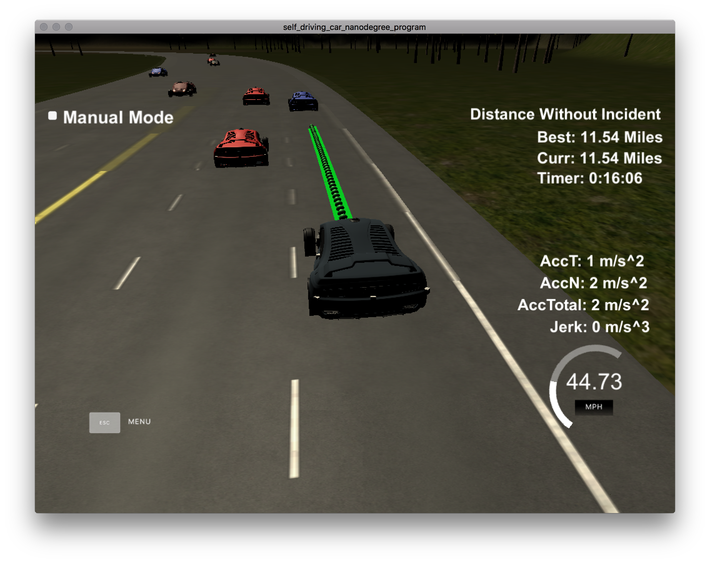

# CarND-Path-Planning-Project
Self-Driving Car Engineer Nanodegree Program

## Goals
The goal for this project is to safely navigate around a virtual highway with other traffic that is driving +-10 MPH of the 50 MPH speed limit.
The car's localization and sensor fusion data is provided by the simulator, as well as a map list of waypoints around the highway.
The car will drive as close as possible to the 50 MPH speed limit, which means passing slower traffic when possible.
The car will avoid hitting other cars as well as driving inside of the marked road lanes, unless going from one lane to another.
The car is able to make one complete loop around the 6946m highway.
Also the car should not experience total acceleration over 10 m/s^2 and jerk that is greater than 50 m/s^3.
   
## Instructions

### Simulator.
The Term3 Simulator containing the Path Planning Project can be downloaded from [here](https://github.com/udacity/self-driving-car-sim/releases).
Simply start the program and the only simulation contained in it.
Then build and run the project (see below) to control the car.

### Basic Build Instructions

1. Clone this repo.
2. Make a build directory: `mkdir build && cd build`
3. Compile: `cmake .. && make`
4. Run it: `./path_planning`.

### Dependencies

* cmake >= 3.5
 * All OSes: [click here for installation instructions](https://cmake.org/install/)
* make >= 4.1
  * Linux: make is installed by default on most Linux distros
  * Mac: [install Xcode command line tools to get make](https://developer.apple.com/xcode/features/)
  * Windows: [Click here for installation instructions](http://gnuwin32.sourceforge.net/packages/make.htm)
* gcc/g++ >= 5.4
  * Linux: gcc / g++ is installed by default on most Linux distros
  * Mac: same deal as make - [install Xcode command line tools]((https://developer.apple.com/xcode/features/)
  * Windows: recommend using [MinGW](http://www.mingw.org/)
* [uWebSockets](https://github.com/uWebSockets/uWebSockets)
  * Run either `install-mac.sh` or `install-ubuntu.sh`.
  * If you install from source, checkout to commit `e94b6e1`, i.e.
    ```
    git clone https://github.com/uWebSockets/uWebSockets 
    cd uWebSockets
    git checkout e94b6e1
    ```

## Model documentation

### Trajectory generation

To generate the trajectories, five sparse points are selected.
The first two points are the last and previous positions of the car.
Selecting both ensures that the generated trajectory will be tangent to the current one.

The next three points are created 30, 60 and 90 meters in front of the car, taking the Frenet coordinate `car_s` and adding this distance.
For the perpendicular Frenet coordinate `d` of the points ahead, the value is always taken to be the center of the target lane.
This allows to maintain the car in its lane smoothly, and as the next point is in 30 meters, also create smooth lane change trajectories.
The following points at 60 and 90 meters ensure that the trajectory will be tangent to the target lane after 30 meters.

A coordinate transform is then applied to those points, placing the car at `(0, 0)` and facing the x-axis.
A spline is created along the five 5 points, and is used to generate the trajectory points.
The distance between those trajectory points is determined by the target velocity of the vehicle and the shape of the spline.
This precise distance calculation allows for to reach speed as close to the target speed as possible.
The trajectory points are then converted back to the global x-y coordinates system of the map.

The reference speed is usually selected to be very close to the speed limit.
However, once a vehicle is detected in the lane a some distance in front of the vehicle, this speed is slowly reduced for each iteration.
Once this distance is clear again, the target speed is gradually increased back to towards the speed limit.

### Behaviour planning

To decide when to change lane, a small behaviour planner was implemented.
First, the behaviour planner checks whether a lane change is required at all, i.e. it checks that the car is currently following another one, and that the current speed is below a certain threshold.
If a lane change is required, then the adjacent lanes are checked for traffic. The left lane is checked first as it usually makes more sense to pass from the left.
If the lane is empty in a certain range in front and behind the car, then a lane change is initiated by changing the target lane.
The trajectory generation (see above) will take care of a smooth change between the lane in a distance of around 30 meters.

### Results

As demonstrated in the following screenshot, the car typically manages to drive around the track without any incidents.



The following criteria are fulfilled during the whole drive:
* Maximum acceleration of 10 m/s<sup>2</sup>.
* Maximum jerk of  10 m/s<sup>3</sup>.
* The car drives according to the speed limit.
* No collisions and stay on the road at all times
* Stays in lane except for lane changes, which do not exceed 3 seconds
* The car is able to change lane.

### Limitations

First, the trajectory points are added to the end of preexisting trajectory.
This means a typical delay between the generation of the point and its execution of around one second.
The car could therefore not be able to react if something happens, for instance another vehicle sudently changing lane in front of us, or braking hard.
This could be corrected by adding a secondary system, like an AEB, that would check for potential collision in the currently planned trajectory.
If such a collision it possible, it would overwrite the preexisting trajectory and create a new one that avoids collisions.

Secondly, the current behaviour of the car might be acceptable for U.S. roads, but it would be considered highly dangerous in Europe. There, cars should change back to the right most lane if this one is free.
Furthermore, it is highly illegal (with immediate driving license removal in some countries) to pass a vehicle from the right side.
Therefore, the lane changing logic should then be adapted to go back to the right lane if it is free.
Furthermore, the speed should be set as to not drive faster than car on the current or any left lane.
The most complicated would be to implement the double lane change logic:
If the car is driving in the right lane, which is free, but there is a car driving slow on the middle lane (which is illegal for that car, but unfortunately happens often), the car should change to the left most lane (two lane changes), pass the slow car then go back to the right lane (two lane changes again).
The car should not keep driving in the right lane and pass the car from there, as it is illegal.
